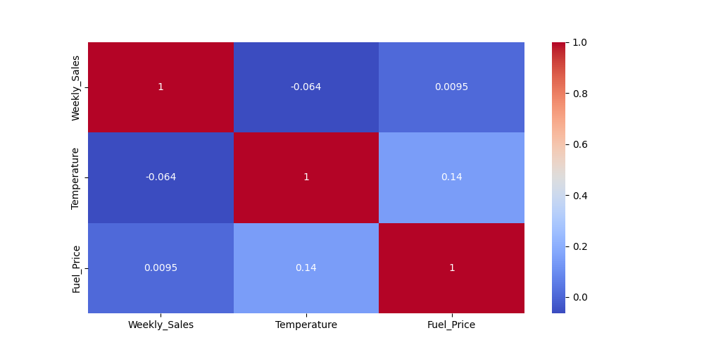

# 🛒 Walmart Sales Analysis

## 📖 Overview

This project performs Exploratory Data Analysis (EDA) on Walmart Sales Data to uncover valuable business insights and identify factors influencing weekly sales performance.

The analysis uses Python, Pandas, Matplotlib, and Seaborn to clean, process, visualize, and analyze sales data from Walmart stores.

The objective is to understand sales trends, store performance, seasonal patterns, and the impact of economic indicators such as fuel prices, temperature, CPI, and unemployment.

---

## 🎯 Business Problem
## Key Business Insights

### Store Performance
- Store 20 generated the highest overall revenue.
- Store 33 generated the lowest revenue and may require operational review.

### Seasonal Trends
- Sales peaked during holiday seasons, particularly in November and December.
- Seasonal demand significantly impacts overall revenue.

### Holiday Impact
- Holiday weeks generated higher sales compared to non-holiday weeks.
- Promotional campaigns during holidays contribute positively to revenue.

### Economic Factors
- Fuel Price showed minimal impact on Weekly Sales.
- Unemployment exhibited a weak relationship with revenue generation.

### Overall Finding
- Seasonal and holiday factors influence sales more strongly than economic variables such as fuel prices and unemployment.

Retail companies generate massive amounts of sales data every day. Analyzing this data helps businesses:

- Identify top-performing stores
- Understand customer demand patterns
- Measure seasonal effects on sales
- Evaluate economic factors affecting revenue
- Make data-driven business decisions

This project aims to answer these business questions through data analysis.

---

## 📂 Dataset Description

The dataset contains the following features:

| Column | Description |
|----------|-------------|
| Store | Store Number |
| Date | Weekly Sales Date |
| Weekly_Sales | Weekly Revenue Generated |
| Holiday_Flag | Indicates Holiday Week (1 = Holiday, 0 = Non-Holiday) |
| Temperature | Temperature in the Region |
| Fuel_Price | Fuel Cost in the Region |
| CPI | Consumer Price Index |
| Unemployment | Unemployment Rate |

---

## 🛠️ Technologies Used

- Python
- Pandas
- NumPy
- Matplotlib
- Seaborn
- Jupyter Notebook

---

## 🔍 Data Cleaning & Preprocessing

The following preprocessing steps were performed:

- Loaded dataset using Pandas
- Checked dataset structure
- Verified data types
- Checked missing values
- Checked duplicate records
- Converted Date column into DateTime format
- Created Month and Year columns from Date

### Feature Engineering

```python
df["Date"] = pd.to_datetime(df["Date"], format="%d-%m-%Y")

df["Month"] = df["Date"].dt.month_name()
df["Year"] = df["Date"].dt.year
```

---

## 📊 Exploratory Data Analysis

### 1. Store Performance Analysis

Analyzed total revenue generated by each store.

**Business Question:**
- Which store generates the highest revenue?
- Which store performs the worst?

---

### 2. Monthly Sales Analysis

Analyzed monthly sales trends.

**Business Question:**
- Which month has the highest sales?
- Which month has the lowest sales?

---

### 3. Yearly Sales Analysis

Analyzed yearly revenue performance.

**Business Question:**
- How does revenue vary across years?

---

### 4. Holiday vs Non-Holiday Sales

Compared sales during holiday and non-holiday periods.

**Business Question:**
- Do holiday weeks generate higher sales?

---

### 5. Temperature Impact on Sales

Analyzed relationship between temperature and weekly sales.

**Visualization:**
- Scatter Plot

---

### 6. Fuel Price Impact on Sales

Analyzed relationship between fuel price and weekly sales.

**Visualization:**
- Scatter Plot

---

### 7. Unemployment Impact on Sales

Analyzed relationship between unemployment and weekly sales.

**Visualization:**
- Scatter Plot
s
---

### 8. Correlation Analysis
## Correlation Analysis



## Temperature vs Weekly Sales


## Fuel Price vs Weekly Sales


```

---

## 📈 Visualizations Included

- Bar Charts
- Scatter Plots
- Correlation Heatmap
- Distribution Plots
- Sales Trend Analysis

---

## 💡 Key Insights

- Identified highest-performing Walmart stores.
- Identified lowest-performing stores.
- Analyzed monthly and yearly sales patterns.
- Measured impact of holidays on sales.
- Examined relationship between temperature and revenue.
- Evaluated economic indicators such as fuel prices and unemployment.
- Used correlation analysis to understand variable relationships.

---

## 📁 Project Structure

```text
Walmart-Sales-Analysis/
│
├── Walmart_Sales.csv
├── Walmart_Sales_Analysis.ipynb
├── README.md
├── requirements.txt
│
└── images/
    ├── store_sales.png
    ├── monthly_sales.png
    ├── holiday_sales.png
    └── heatmap.png
```

---

## 🚀 How to Run the Project

### Clone Repository

```bash
git clone https://github.com/your-username/Walmart-Sales-Analysis.git
```

### Move Into Project Directory

```bash
cd Walmart-Sales-Analysis
```

### Install Dependencies

```bash
pip install -r requirements.txt
```

### Launch Jupyter Notebook

```bash
jupyter notebook
```

Open:

```text
Walmart_Sales_Analysis.ipynb
```

---

## 📦 Requirements

Create a file named:

```text
requirements.txt
```

Paste:

```text
pandas==2.3.0
numpy==2.3.1
matplotlib==3.10.3
seaborn==0.13.2
jupyter==1.1.1
```

---

## 🔮 Future Improvements

- Sales Forecasting using Machine Learning
- Interactive Streamlit Dashboard
- Power BI Dashboard
- Store Revenue Prediction
- Demand Forecasting Models
- XGBoost and Random Forest Implementation

---

## 👨‍💻 Author

### Pawan Bhokare

Aspiring Data Scientist & AI/ML Engineer

**Skills:**
- Python
- Pandas
- NumPy
- SQL
- Machine Learning
- Data Visualization
- Power BI

GitHub: https://github.com/Codewithpwn

LinkedIn: www.linkedin.com/in/pawan-bhokare

---

⭐ If you found this project useful, consider giving it a star.